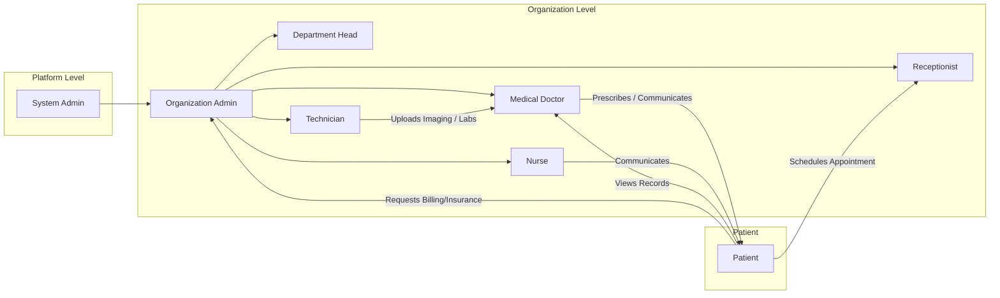

# User Personas for the Enterprise Healthcare Management Platform

## Introduction

This document provides comprehensive business-driven profiles for all key user personas of the healthcarePlatform SaaS. Each persona’s core goals, pain points, responsibilities, and system interaction flows are described so backend developers can design robust, compliant features and access controls that support operational realities.

All requirements are stated in actionable, testable natural language, with EARS structure wherever possible.

---

## Persona Overviews

Below are the primary user personas, mapped to business roles within healthcare organizations:

| Persona             | Description                                                                                  |
|---------------------|---------------------------------------------------------------------------------------------|
| System Administrator| Full platform-wide oversight, integration, security, and audit management.                   |
| Organization Admin  | Manages a specific organization: staff, facilities, billing, reporting, and compliance.      |
| Department Head     | Leads a department (e.g., Cardiology), owning scheduling, analytics, budget, and coordination.|
| Medical Doctor      | Licensed provider for diagnosis, treatment management, and full patient record authority.     |
| Nurse              | Clinical staff managing daily care, vitals updates, and patient communications.               |
| Technician         | Diagnostic/technical staff for imaging, lab, equipment, and medical data integration.         |
| Receptionist       | Coordinates appointments, check-in/out, and non-clinical patient/admin logistics.             |
| Patient            | End user needing self-health management, scheduling, messaging, billing review, and privacy.  |

---

## Goals and Pain Points

### System Administrator
- **Goals:** Ensure secure, compliant, always-on operation; manage system-wide integrations and analytics; enforce global auditing.
- **Pain Points:** Need for failure-resistant operations, clarity of audit trails, incident root cause analysis, keeping system compliant across regions.

### Organization Admin
- **Goals:** Run all aspects of their organization—staff onboarding, compliance, billing, reporting. Rapidly configure organization-specific policies and utilities.
- **Pain Points:** Avoiding accidental data leaks, managing many users/facilities, staying ahead of audits, handling billing/insurance mismatches.

### Department Head
- **Goals:** Optimize departmental performance: staff/resource schedules, analytics, budget, and departmental compliance. Improve departmental patient outcomes.
- **Pain Points:** Inefficient scheduling, limited performance visibility, friction in departmental approvals, resource shortages, manual coordination efforts.

### Medical Doctor
- **Goals:** Deliver top-quality care; fast and safe access to complete patient records; simple order/prescription flows, audit-safe documentation.
- **Pain Points:** Inefficient navigation of medical records, delays from permission boundaries, diagnostic workflow interruptions, audit ambiguity, too many manual approvals.

### Nurse
- **Goals:** Seamless care coordination; accurate charting of vitals/meds; clear communication of patient changes; involvement in care workflows.
- **Pain Points:** Record update delays, unclear handoff/care collaboration, workflow fragmentation, and approval bottlenecks for key changes.

### Technician
- **Goals:** Timely upload and access to imaging/lab information, efficient annotation capabilities; proper task assignment.
- **Pain Points:** Data silos reducing technical/clinical workflow, manual upload/approval delay, missing data linkages, insufficient access to tasks/orders.

### Receptionist
- **Goals:** Fast, accurate appointment scheduling; smooth patient check-in/out; clear lines between clinical and admin access; real-time calendar management.
- **Pain Points:** Double-bookings, calendar conflicts, limitations on data visibility, slow response for schedule changes.

### Patient
- **Goals:** Full personal medical access; easy appointment/telemedicine booking; clear, timely billing/insurance access; trust in data privacy; ability to manage consent.
- **Pain Points:** Difficult access to own data, appointment scheduling friction, unclear bills, lack of real-time updates, insufficient transparency into care team actions.

---

## User-Specific Workflows

Every persona participates in one or more key workflows:

### System Administrator
- Manages tenant onboarding and configuration
- Oversees system health, deployment status, and alerts
- Configures global integrations (EMR, billing, analytics)
- Performs organization-level and global audits
- Monitors platform security posture, incident response, and compliance status

### Organization Admin
- Onboards staff members, configures their departments/permissions
- Sets up billing/insurance policies and oversees financial data
- Accesses compliance dashboards and audit logs
- Configures facility/resource settings and staff schedules

### Department Head
- Schedules staff/resources for their department
- Monitors department KPIs (bed occupancy, procedure volumes, etc.)
- Reviews department billing and budget utilization
- Manages internal approvals, escalations, and departmental regulatory reports

### Medical Doctor
- Accesses full scope of patient medical records within organization and department
- Creates/modifies clinical notes, diagnosis, orders, and e-prescriptions
- Reviews lab/imaging results and receives alerts for critical values
- Coordinates care and referrals within patient circle
- Manages scheduled telemedicine/video consults

### Nurse
- Monitors patient status and records vitals/notes throughout shift
- Administers medication as per doctor orders and records medication events
- Flags critical events for escalation/approval
- Communicates with other care team members about patient changes

### Technician
- Processes orders for diagnostic procedures (imaging/lab)
- Uploads technical data (DICOM, lab results), annotates as needed
- Flags abnormal or urgent findings for provider review

### Receptionist
- Manages appointment bookings (provider, room, telemedicine)
- Handles patient check-in/out and updates logistics data
- Manages provider/resource calendars, communicates schedule changes to staff and patients

### Patient
- Registers and verifies personal information/identity
- Requests, reviews, and manages appointments (in-person and telemedicine)
- Views full medical history, images, lab results (as permitted)
- Interacts via secure messaging to care team
- Manages billing, payments, insurance submissions
- Sets or revokes data consent and privacy permissions

---

## Role-Based Scenario Examples

### 1. Emergency Access (Break-the-Glass)
WHEN an emergency situation arises and standard access limitations would impede urgent care, THE healthcarePlatform SHALL allow authorized medical personnel to override data access restrictions, WHILE recording the event and requiring post-incident review.

### 2. Prescription Workflow
WHEN a medical doctor prescribes a new medication, THE healthcarePlatform SHALL perform drug interaction and allergy checks before order submission. IF an unsafe interaction is detected, THEN THE system SHALL notify the doctor with a blocking alert and require explicit override with reason and digital signature.

### 3. Imaging Upload and Review
WHEN a technician uploads a DICOM image for a patient, THE healthcarePlatform SHALL index the image, distribute it to the care team, and notify the relevant doctor and nurse for review.

### 4. Billing Dispute Handling
WHEN a patient queries a bill or insurance charge, THE healthcarePlatform SHALL provide detailed line-item explanations and route the inquiry to the appropriate admin for follow-up within one business day.

### 5. Consent Revocation
WHEN a patient revokes consent to share medical data, THE healthcarePlatform SHALL immediately log the request, block further data sharing outside regulatory requirements, and notify the organization admin and involved providers.

---

## Mermaid Diagram: Persona Interactions (Sample)

---

## EARS-based Requirements Summary

- THE healthcarePlatform SHALL provide role-based access control for all business scenarios above.
- WHEN a user attempts an action outside their permission, THE healthcarePlatform SHALL deny the action, notify the user, and record the failed attempt.
- WHEN any access to patient data occurs, THE healthcarePlatform SHALL log access with user ID, reason, and timestamp.
- WHEN workflows require approval (record updates, prescription overrides), THE healthcarePlatform SHALL require digital signatures and log all approval events.
- WHEN an error occurs that impedes a workflow (e.g., unavailable resource, data conflict, expired session), THE healthcarePlatform SHALL present a clear explanation to the user and log the failure event for audit.

---

## Conclusion

This persona analysis ensures that backend development aligns deeply with real-world user responsibilities, permission boundaries, and business processes, providing strong foundations for all subsequent requirements, compliance, and system validation.
