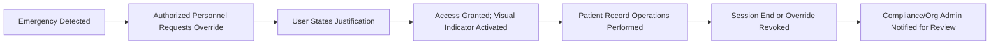
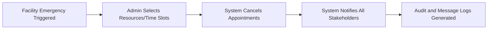
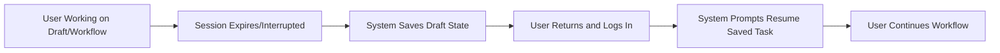

# Secondary User Scenarios and Edge Cases for Enterprise Healthcare Management Platform

## 1. Document Purpose & Scope

Secondary user scenarios are critical to ensuring the reliability, compliance, and flexibility of the healthcarePlatform. These business requirements comprehensively define how the system shall behave under unusual, rare, or edge-case conditions, bulk operations, and exceptional workflow situations—all of which impact system robustness, safety, user trust, and regulatory auditability. Only testable, actionable business requirements are included, using EARS format as applicable.

## 2. Edge Cases and Alternative Flows

### 2.1 Emergency Access (“Break-the-Glass” Scenarios)
- WHEN an emergency is declared by authorized medical staff, THE system SHALL allow designated personnel to override normal access limits for patient records, provided all actions are logged with justification and scheduled for post-incident compliance review.
- IF emergency override access is used, THEN THE system SHALL force the user to state a reason, SHALL display a visual indication of override status, and SHALL flag the user's actions for review.
- WHEN the emergency override period ends, THE system SHALL revert access to baseline role/consent-based limits and notify compliance and org admin roles.

### 2.2 Partial User Activation/Deactivation
- WHEN an organizationAdmin or departmentHead attempts to deactivate a staff user with active clinical, billing, or scheduling assignments, THE system SHALL display a list of outstanding responsibilities, block deactivation until handoff or closure, and require confirmation of next steps.
- WHERE a deactivated staff member is reactivated after 30+ days, THE system SHALL mandate automatic re-validation of professional licenses/certifications before restoring access.
- IF license revalidation fails, THEN THE system SHALL deny reactivation and notify compliance and organizationAdmin roles.

### 2.3 Duplicate Identities or License Handling
- WHEN a new user account for a licensed clinician (medicalDoctor/nurse) is created using an NPI or license number already registered, THE system SHALL pause account activation, require identity review by organizationAdmin, and block duplicate access until resolved by merge/assignment.
- IF duplicates are unresolved, THEN THE system SHALL escalate the issue to systemAdmin for possible merge or audit.

### 2.4 Ambiguous Department/Provider Assignment
- WHEN staff are assigned overlapping shifts or roles across departments, THE system SHALL detect scheduling conflicts and prevent double-assignment for direct patient care.
- IF department context is missing or inconsistent (e.g., unassigned shift), THEN THE system SHALL block schedule finalization and prompt admin-level correction.

### 2.5 Patients Registered Under Multiple Organizations
- WHEN a patient is present in more than one organization's system (import, registration, or transfer), THE system SHALL isolate records, billing, and appointment flows for each org.
- IF a patient requests data migration or record sharing across organizations, THEN THE system SHALL require explicit, auditable patient consent and authorize organizationAdmin to start the sharing process.

### 2.6 Record Version Conflicts (Concurrent Edits)
- WHEN two or more users attempt to edit the same patient record or EHR entry at once, THE system SHALL queue amendments and require a conflict resolution workflow, requiring explicit user confirmation/merge before any version is finalized.
- IF unresolvable conflicts persist, THEN THE system SHALL escalate to departmentHead and compliance roles for manual intervention.

### 2.7 Unexpected Session Expiry or Logout
- IF a user session expires during a critical workflow (order, documentation, billing entry), THEN THE system SHALL save in-progress data as a recoverable draft for 6 hours and automatically prompt the user to resume the task on next login.
- WHEN a system-initiated logout occurs for security reasons (e.g., device risk), THE system SHALL display a message indicating the cause, log the event for audit, and present a recovery path (e.g., session restart, password reset).

### 2.8 Bulk Scheduling Cancellations (e.g., Facility Closure)
- WHEN a facility-level emergency (disaster, outbreak) requires mass cancellation of appointments, THE system SHALL allow authorized admin users to select providers, resources, and time windows for bulk cancellation and automatically notify all affected patients and staff, generating a complete audit log.
- IF automated notification fails for any recipient, THEN THE system SHALL display an actionable alert to staff and support alternate communication/rescheduling workflows.

## 3. Bulk Operations

### 3.1 Bulk User Onboarding
- WHEN importing or inviting multiple staff accounts (10+), THE system SHALL validate credentials/licenses for all clinical users and flag any errors for admin review before activation.
- IF any license/status check fails, THEN THE system SHALL prevent activation for flagged users and require resolution.

### 3.2 Mass Patient Data and Consent Updates
- WHEN an org-wide update is required (consent, demographic fields, policy changes), THE system SHALL enforce stepwise review/approval, record each batch's processing status, and allow granular notification to affected patients.
- IF a bulk update fails or only partially completes, THEN THE system SHALL present detailed reports, rollback incomplete changes if necessary, and flag issues for admin intervention while preventing inconsistent data states.

### 3.3 Bulk Notifications/Messaging
- WHEN a user sends mass messages/alerts (recall, health advisory, portal update), THE system SHALL log each recipient, send status, and allow retry for failed or bounced contacts. Mass communication must always use consent-validated channels and produce an exportable notification log.

### 3.4 Bulk Offboarding/Deactivation
- WHEN staff or patient accounts are bulk-deactivated (org offboarding, role change), THE system SHALL require checks for open clinical/billing activity, notify responsible parties, and block incomplete deactivation. A summary report SHALL be provided for compliance/audit.

## 4. Exception Handling and User Recovery

### 4.1 Validation and Submission Errors
- IF a form submission or workflow fails validation (missing required field, incorrect data, etc.), THEN THE system SHALL present specific, actionable error messages identifying fields to fix, and SHALL prevent further action until all issues are resolved.

### 4.2 Transaction, Claim, or API Failures
- IF a billing/insurance transaction or external system (lab, pharmacy, insurer) integration fails, THEN THE system SHALL log the error, notify the end user with a clear explanation, auto-retry within policy, and offer fallback/manual escalation for unresolved failures.

### 4.3 Permission or Consistency Violations
- IF a user attempts a prohibited action (e.g., insufficient permission, restricted data, locked record), THEN THE system SHALL deny the action, display a clear error, log the attempt, and specify the escalation path for appeals or requests.
- WHEN organizational configuration changes (e.g., new appointment or data policy), THE system SHALL enforce the updated rule at the entry point of affected workflows, inform users of the policy change, and block now-prohibited actions.

### 4.4 Locked or Blocked Record States
- WHEN a record is locked for audit, legal hold, or compliance investigation, THE system SHALL display read-only mode for all except authorized reviewers and indicate the lock reason.

### 4.5 Automated Error Recovery
- WHEN recoverable errors (e.g., network loss, incomplete save) are detected, THE system SHALL preserve work-in-progress, provide a recovery option, and send a user notification on next login or workflow entry.

## 5. Organizational Customization Scenarios

### 5.1 Patient Portal Feature Toggles and Restrictions
- WHERE organizational settings enable or disable patient portal modules (telemedicine, messaging, record access), THE system SHALL strictly expose only allowed features per config, hiding ineligible options and validating access at runtime.
- WHEN a patient portal experience is configuration-based, THE system SHALL display custom help and support content reflecting permitted features.

### 5.2 Localization and Accessibility Overrides
- WHERE organizations operate multi-site or multi-lingual clinics, THE system SHALL deliver all content and notifications in the site’s configured language (English, Spanish), and shall comply with WCAG 2.1 AA accessibility requirements for patient- and provider-facing modules.
- THE system SHALL allow organizationAdmins to request updates to supported languages or accessibility configuration via admin tools, generating an audit log when changes are made.

### 5.3 Elevated Department Permissions and Approvals
- WHERE a departmentHead is temporarily granted extra permissions (e.g., budget, HR, compliance access), THE system SHALL require multi-level approval, log the elevation, timebox the change, and roll back automatically at period end or manual revocation.
- THE system SHALL notify organizationAdmin and compliance roles of all escalations and grant revocation events.

### 5.4 Org-Level Policy and Consent Updates
- WHEN an organization updates overall privacy, consent, or terms of use, THE system SHALL require affected users to review and accept changes on next login and record acceptance/refusal in audit logs.
- IF a user declines new terms/consent, THEN THE system SHALL block all non-essential access except for appeals or questions to staff.

### 5.5 Billing and Workflow Customizations
- WHERE an organization enables advanced billing features (auto-auth, split billing), THE system SHALL enforce activation only for participating orgs, adjust validation and notifications for those flows, and retain standard flows for others. All customizations must meet baseline compliance standards.

## 6. Visual Diagrams for Scenarios

### 6.1 Mermaid: Emergency Break-the-Glass Flow

### 6.2 Mermaid: Bulk Appointment Cancellations

### 6.3 Mermaid: Error Recovery from Session Loss

## 7. Success Criteria
- THE system SHALL be fully resilient and auditable under all outlined scenarios, with clear user notification, real-time error recovery options, and complete event logging for each edge case and bulk operation.
- THE system SHALL allow organizational customization without compromising core compliance or audit standards.
- Documentation of these scenarios SHALL enable backend developers to implement production-grade business logic for rare and exception scenarios, eliminating ambiguity, and ensuring error handling matches operational needs.
