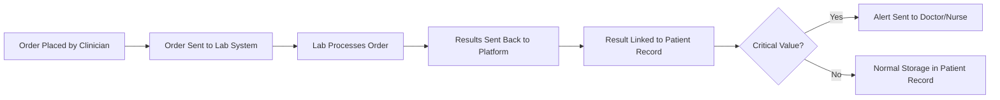
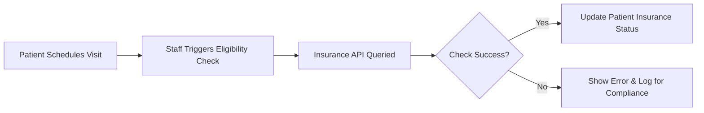

# Integration Requirements for Enterprise Healthcare Management Platform

## Introduction
This document exhaustively details the business-driven requirements, triggers, and policies governing integrations between the healthcarePlatform and external systems for healthcare providers, laboratories, pharmacies, insurance entities, and medical devices. Requirements are written for backend developers tasked with delivering production-ready, compliant, and highly maintainable interoperability.

## Integration Landscape Overview
THE healthcarePlatform SHALL support multi-tenant integration with a diverse set of third-party healthcare systems, including but not limited to:
- EMR/EHR platforms (Epic, Cerner, AllScripts)
- Laboratory information systems (LabCorp, Quest Diagnostics, others)
- Pharmacy and e-prescribing networks
- Insurance verification and claims processing systems
- Medical monitoring and diagnostic devices (via HL7/FHIR)

Integration processes SHALL guarantee data and operational isolation for all tenant organizations and support regulatory requirements including HIPAA and SOC 2 Type II (future-readiness).

## Healthcare System Interoperability
### EMR/EHR Integration (Epic, Cerner, AllScripts, etc.)
- THE healthcarePlatform SHALL enable batch and real-time synchronization of patient, clinical, and administrative data with external EMR/EHR systems using HL7 FHIR R4 standard.
- WHEN nightly batch window is scheduled for an organization, THE healthcarePlatform SHALL initiate export and import of updated patient records, appointments, and billing encounters with mapped data fields and validation for completeness.
- WHERE future requirements include real-time data exchange, THE healthcarePlatform SHALL support push/pull subscription workflows (webhook-driven or polling as per third-party capability).
- THE platform SHALL support bidirectional updates or document limitations and read-only configurations per contract.
- THE platform SHALL ensure mapping between internal patient/visit IDs and external EMR keys for full traceability.
- IF integration with a specific EHR is interrupted, THEN THE platform SHALL log the failure, notify organizationAdmin and systemAdmin roles within 5 minutes, and attempt recovery per configured retry policy.

### HL7 FHIR and C-CDA Document Exchange
- THE healthcarePlatform SHALL produce and consume clinical documents (e.g., care plans, discharge summaries, CCDs) conforming to HL7 FHIR R4 and C-CDA standards for all interoperable workflows.
- WHEN a clinician (medicalDoctor or nurse) completes or updates a care summary, THE system SHALL generate updated C-CDA documents for transmission or import as required.
- THE system SHALL validate incoming/outgoing documents for schema, completeness, and patient match accuracy, logging any errors for compliance.

## Laboratory and Pharmacy Integrations
### Laboratory System (LabCorp, Quest Diagnostics, etc.) Integration
- WHEN an order for laboratory diagnostics is placed by a clinician, THE healthcarePlatform SHALL securely transmit the order via supported LIS integration (HL7, REST, other as required by vendor contract).
- WHEN results are posted by the lab, THE platform SHALL receive, validate, and import results, linking them to the correct patient, visit, and care episode.
- IF a critical lab value or abnormal result is received, THEN THE system SHALL trigger alerts to the assigned medicalDoctor and nurse, record the alert event in the audit trail, and update status dashboards as per configuration.
- THE system SHALL log all order/result transactions for compliance and quality reporting.

### E-Prescribing and Pharmacy Networks
- WHEN an e-prescription is created and finalized by a medicalDoctor, THE healthcarePlatform SHALL validate prescription drug interactions and allergies, generate appropriate prescription messages, and transmit them electronically to the selected pharmacy partner (via NCPDP standards or equivalent).
- IF transmission to pharmacy fails, THEN THE platform SHALL notify the prescriber within 1 minute and log for compliance.
- THE system SHALL receive confirmation/refill requests, update prescription records, and notify care teams as appropriate.
- THE system SHALL support integration with insurance pharmacy benefit managers for drug coverage checks.

## Insurance Processing Integrations
### Real-time Eligibility Verification
- WHEN a patient is scheduled for a visit or procedure, THE healthcarePlatform SHALL allow staff (receptionist, nurse, organizationAdmin, etc.) to trigger real-time insurance eligibility and coverage checks against payer APIs.
- IF the payer system is unavailable or returns an error, THEN THE system SHALL surface a clear error message and log the failed attempt for both business and compliance audit.
- Successful eligibility checks SHALL update patient insurance records and support automated prior authorization workflows if required.

### Claims Submission and Settlement
- WHEN a billable encounter is finalized, THE platform SHALL generate claim records mapped to standardized code sets (ICD-10, CPT, etc.) and submit to the payer clearinghouse or API endpoint as required.
- IF a claim is denied or rejected, THEN the system SHALL log all details, notify billing/revenue staff (organizationAdmin), and enable workflow for corrections or appeals.
- THE system SHALL track settlement status and update financial reporting per payment or adjustment events.

## Cross-System Data Exchange and Policy
### Triggers for Integration/Sync Events
- THE platform SHALL provide:
   - Schedule-based triggers (e.g., nightly or on-demand sync)
   - Manual triggers by authorized staff roles
   - Automatic triggers on critical business events (e.g., new patient registration, discharge, order entry, prescription refill)
- Triggers SHALL be role- and tenant-isolated: only users with explicit permission (see [User Roles and Authentication Specification](./02-user-roles-and-authentication.md)) may initiate or view integration events for their organization.

### Required Response Times, Error Handling, and Resilience
- FOR all real-time integrations, THE platform SHALL return success/failure notification to the triggering user within 10 seconds (target 95p response time <5s where supported by the external API).
- IF an external system is unreachable or returns unexpected/incomplete data, THEN THE platform SHALL display a clear error message, log for compliance, automatically retry based on organization policy, and escalate to systemAdmin if failures persist.
- THE system SHALL implement circuit-breaker logic when rate limits or extended external failures are encountered and notify staff accordingly.
- All integration failures SHALL trigger both operational and compliance alerts.

### Data Security, Privacy, and Consent Policies
- THE platform SHALL encrypt all external data exchanges using TLS 1.3 or successor protocols.
- PHI and PII SHALL only be transmitted where consent is on file as tracked in the patient's record.
- All data transactions SHALL be logged with actor, organization, timestamp, data scope, and purpose for HIPAA traceability (10-year retention, automated cold storage after 2 years).
- WHERE a patient's authorization is revoked, THE system SHALL suspend integration for that patient and audit events accordingly.

## Business Validation and Reporting
### Auditability, Monitoring and Alerting
- THE platform SHALL log all integration actions—initiation, data exchanges, errors, success/failure, and user notifications—using structured logging (correlation IDs, event type, tenant context).
- Monitoring SHALL cover all integration endpoints with real-time alerting for failures and major SLA misses (via OpenTelemetry instrumentation).
- THE platform SHALL generate reports of integration status, data exchange volume, and error/event logs for staff and compliance auditors based on role permissions.

### Compliance Logging and Traceability
- All inbound/outbound integration events SHALL be mapped to user actions and presented in the audit interface for organizationAdmin and auditors.
- IF a compliance investigation requires event logs, THEN THE system SHALL present all required details (who, when, what, why) across tenants, with complete isolation.

## Mermaid Diagrams

### 1. Patient Lab Order and Result Workflow

### 2. Insurance Eligibility Verification

## Success Criteria and Implementation Expectations
- Integration points outlined above SHALL be considered mission-critical for tenant onboarding and day-to-day operations.
- All integrations SHALL have production-grade monitoring, complete audit traceability, secure transport, and robust error handling.
- Role-based and tenant-based isolation SHALL be strictly enforced for all integrated events, data flows, and audit logs.
- THE healthcarePlatform SHALL be extensible to accommodate new integration partners and standards as required by evolving healthcare business needs.

## Reference Documents
- For role-based permission and authentication policies, see the [User Roles and Authentication Specification](./02-user-roles-and-authentication.md).
- Audit and compliance logic is covered in [Compliance and Regulatory Overview](./11-compliance-and-regulations.md).
- For full functional flows and data handling scenarios, reference the [Functional Requirements Document](./03-functional-requirements.md).

---

This document specifies business requirements for external integrations only. Technical implementation is at the discretion of the development team. All requirements use EARS syntax where applicable and are designed to support strict compliance, audit, and operational business continuity.