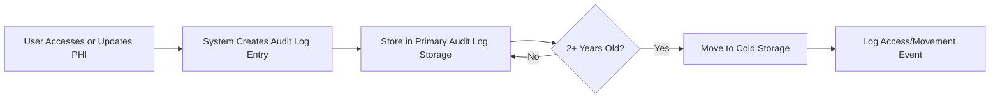
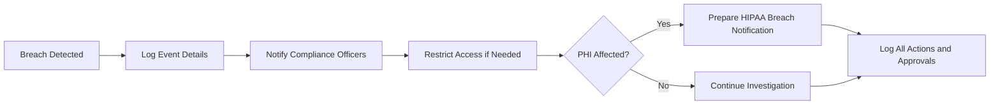

# Compliance and Regulations for Enterprise Healthcare Management Platform

## Regulatory Overview

THE healthcarePlatform SHALL comply with all United States HIPAA requirements for safeguarding Protected Health Information (PHI). THE healthcarePlatform SHALL be designed with SOC 2 Type II controls in mind, to support future expansion into enterprise and regulated markets. THE healthcarePlatform SHALL comply with all applicable state healthcare information retention laws, breach response requirements, and reporting obligations, as relevant to organizations operating on the platform.

### Regulatory Standards
- HIPAA (Health Insurance Portability and Accountability Act of 1996)
- SOC 2 Type II Trust Services Criteria (Security, Availability, Processing Integrity, Confidentiality, Privacy)
- State-specific data retention and reporting requirements for patient records
- Guidelines for medical data (e.g., use of NPI registry, C-CDA document standards, HL7 FHIR data handling)

## HIPAA and SOC 2 Alignment

### HIPAA
- THE platform SHALL ensure that all PHI is encrypted at rest (AES-256) and in transit (TLS 1.3).
- THE platform SHALL strictly control all data access through user authentication and authorization mechanisms as defined in the [User Roles and Authentication Requirements](./02-user-roles-and-authentication.md).
- WHEN any user accesses, modifies, exports, or deletes PHI, THE platform SHALL record the action, user identity, role, time, intent, and context.
- WHEN an emergency "break-the-glass" access occurs, THE platform SHALL require immediate audit logging and trigger a post-incident review as per business rules.
- WHERE organization-specific compliance policies exist, THE platform SHALL allow configurable policies to ensure local legal obligations are met.

### SOC 2 Type II (Future-Ready)
- THE platform SHALL support generation of audit logs suitable for SOC 2 attestation by tracking access, system events, and business process adherence for all tenants.
- THE platform SHALL support regular reviews and reporting for the five trust criteria, with focus on automated evidence collection where feasible.
- THE platform SHALL allow organizations to configure additional compliance features and evidence-gathering mechanisms as required for enterprise clients.

## Audit Trail Policies

- THE platform SHALL maintain immutable audit logs of all access, modification, and export operations involving PHI and critical system resources.
- THE audit logs SHALL include: timestamp, user identity, user role, organization, affected resource, action taken, purpose for access, and outcome/result.
- THE platform SHALL provide audit log review and export capabilities to authorized users (e.g., compliance officers, system/organization admins). Access to audit logs SHALL itself be logged.
- THE platform SHALL retain audit logs for a minimum of 10 years, with automated archiving of events after 2 years to secure, immutable cold storage. WHEN logs are moved or accessed in cold storage, THE system SHALL record the event.
- IF a log tampering attempt is detected, THEN THE platform SHALL notify designated compliance officers and trigger a breach review workflow.

Mermaid diagram defining audit trail policy:

## Handling of Breaches and Investigations

- WHEN a security breach or anomalous access is detected (e.g., excessive failed logins, unauthorized PHI access), THE platform SHALL initiate an incident workflow:
  - Log the event details, including system context and all user actions
  - Notify designated compliance officers for the affected organization
  - Temporarily restrict access to suspected accounts or data
  - Generate a breach report for investigation
- THE platform SHALL track all investigative actions, findings, and final outcomes in the audit system.
- WHEN a breach is confirmed as affecting PHI, THE platform SHALL support notification workflows in compliance with HIPAA breach notification rule (including HHS and impacted individuals, as configured by the organization).
- THE platform SHALL provide tools for organizations to document breach response and investigations to support external audits and internal postmortems.
- IF evidence tampering or incomplete investigation is detected, THEN THE platform SHALL block report closure until compliance officer reviews and approvals are logged.

Mermaid diagram for breach response process:

## Ongoing Risk Assessment

- THE platform SHALL require each organization to perform and document periodic risk assessments (minimum annually, or as required by law).
- WHEN new features, integrations, or data flows are added, THE platform SHALL provide tools to reassess compliance and document risk controls.
- THE platform SHALL allow organizations to assign responsible staff for risk management tasks, with all risk assessments, updates, and mitigating actions tracked in the audit log.
- THE platform SHALL provide automated prompts and reminders for overdue assessments.
- WHERE compliance gaps or risks are identified, THE platform SHALL enable flagging, escalations, and assignment of remediation tasks with full accountability tracked.
- THE platform SHALL provide exports and visual summaries of compliance status, recent risk assessments, and open issues per organization.

## Complete Listing of EARS Requirements from This Document

- THE healthcarePlatform SHALL comply with HIPAA and relevant state healthcare data regulations.
- THE healthcarePlatform SHALL support SOC 2 Type II audit practices and evidence collection.
- WHEN users access, modify, export, or delete PHI, THE healthcarePlatform SHALL record action, actor, intent, and outcome.
- THE healthcarePlatform SHALL maintain 10-year immutable audit logs, with 2-year transition to cold storage.
- WHEN a breach or anomalous access is detected, THE healthcarePlatform SHALL initiate breach investigation and notification workflows.
- THE healthcarePlatform SHALL require and record periodic risk assessments per organization.
- IF log tampering, evidence loss, or incomplete investigation is detected, THEN THE healthcarePlatform SHALL prevent report closure until reviewed and approved by compliance officers.

This document provides business requirements only. All technical implementation decisions belong to developers. The document describes WHAT the system should do, not HOW to build it.