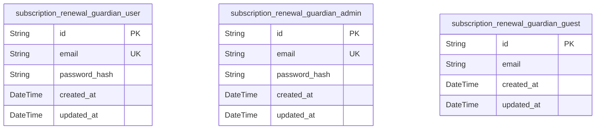
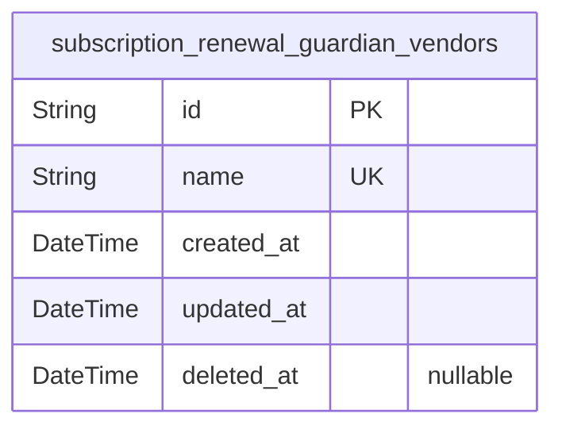
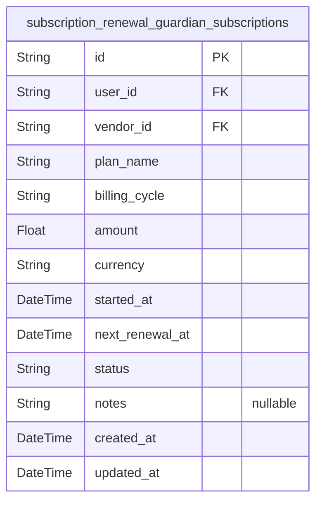
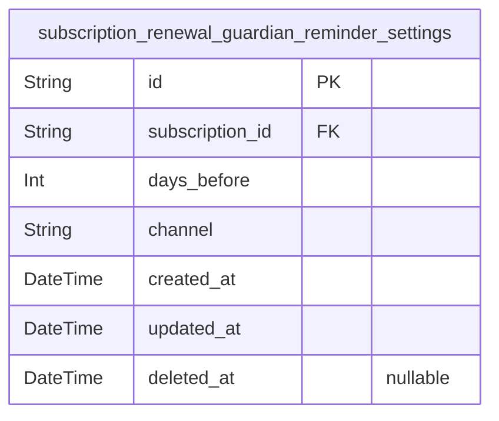

# Prisma Markdown

> Generated by [`prisma-markdown`](https://github.com/samchon/prisma-markdown)

- [Identity](#identity)
- [Vendors](#vendors)
- [Subscriptions](#subscriptions)
- [Reminders](#reminders)

## Identity

### `subscription_renewal_guardian_user`

User accounts representing authenticated individuals who can manage their
own subscriptions, vendors, and reminder settings. Includes secure
authentication fields such as email and password hash. Primary key is
UUID `id`. Contains audit timestamps for creation and updates.

Properties as follows:

- `id`: Primary Key.
- `email`: User's unique email address used for login and identification.
- `password_hash`: Hashed password for secure authentication.
- `created_at`: Timestamp when the user account was created.
- `updated_at`: Timestamp when the user account was last updated.

### `subscription_renewal_guardian_admin`

Administrator accounts with read-only access to all users’ subscription
data. Includes login credentials and audit timestamps. Primary key is
UUID `id`. Email must be unique across admins.

Properties as follows:

- `id`: Primary Key.
- `email`: Administrator's unique email address.
- `password_hash`: Hashed password for admin authentication.
- `created_at`: Timestamp when the admin account was created.
- `updated_at`: Timestamp when the admin account was last updated.

### `subscription_renewal_guardian_guest`

Guest users are unauthenticated visitors who can register and login. This
table tracks guest registration attempts or temporary data as needed.
Primary key is UUID `id`. Created and updated timestamps for record
maintenance.

Properties as follows:

- `id`: Primary Key.
- `email`: Guest user's email address for registration or identification.
- `created_at`: Timestamp when the guest record was created.
- `updated_at`: Timestamp when the guest record was last updated.

## Vendors

### `subscription_renewal_guardian_vendors`

Represents vendors providing subscription services such as Netflix or
Spotify. Vendors are unique by name and serve as core entities referenced
by user subscriptions. This table stores vendor details with creation and
update timestamps and supports soft deletion.

Properties as follows:

- `id`: Primary Key.
- `name`: Unique name of the vendor representing subscription service provider.
- `created_at`: Record creation timestamp in UTC.
- `updated_at`: Record last update timestamp in UTC.
- `deleted_at`: Timestamp indicating soft deletion of the record; null if active.

## Subscriptions

### `subscription_renewal_guardian_subscriptions`

Stores user subscriptions with details about vendor, plan, billing cycle,
financials, status, and renewal scheduling. This model represents primary
user-managed subscriptions with lifecycle status transitions: ACTIVE,
PAUSED, and CANCELED. It references users and vendors, enabling tracking
and notification of upcoming renewals.

Properties as follows:

- `id`: Primary Key.
- `user_id`: Belonged user's [subscription_renewal_guardian_user.id](#subscription_renewal_guardian_user).
- `vendor_id`: Subscribed vendor's [subscription_renewal_guardian_vendors.id](#subscription_renewal_guardian_vendors).
- `plan_name`: Name of the subscription plan. Unique per user and vendor.
- `billing_cycle`: Billing cycle interval. Allowed values: DAILY, WEEKLY, MONTHLY, YEARLY.
- `amount`: Subscription amount, must be >= 0.
- `currency`: Currency code following ISO 4217 3-letter uppercase format.
- `started_at`: Subscription start date in UTC ISO 8601 format.
- `next_renewal_at`
  > Next scheduled renewal date in UTC ISO 8601 format. Calculated by
  > advancing started_at by billing cycle intervals until strictly greater
  > than current time.
- `status`: Subscription status. Allowed values: ACTIVE, PAUSED, CANCELED.
- `notes`: Optional notes about the subscription.
- `created_at`: Record creation timestamp in UTC ISO 8601 format.
- `updated_at`: Record last update timestamp in UTC ISO 8601 format.

## Reminders

### `subscription_renewal_guardian_reminder_settings`

Reminder settings attached to subscriptions for renewal notifications.
Each setting defines how many days before renewal to notify and via which
channel. Uniqueness enforced on subscription and days_before. Supports
created_at, updated_at, and soft delete timestamps.

Properties as follows:

- `id`: Primary Key.
- `subscription_id`
  > Referenced subscription's {@link
  > subscription_renewal_guardian_subscriptions.id}.
- `days_before`
  > Number of days before the subscription renewal to send the reminder.
  > Allowed values are 7, 3, or 1.
- `channel`: Communication channel for reminders. Allowed values are 'EMAIL' or 'NONE'.
- `created_at`: Timestamp when the reminder setting was created.
- `updated_at`: Timestamp when the reminder setting was last updated.
- `deleted_at`: Timestamp when the reminder setting was soft deleted. Null if not deleted.
