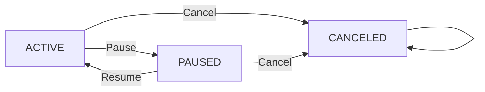

# Functional Requirements for Subscription & Renewal Guardian

## 1. Introduction and Business Justification

Subscription & Renewal Guardian enables users to monitor and manage their personal subscription services from various vendors, ensuring awareness of billing cycles and upcoming renewal dates through automated tracking and reminders.

### Why This Service Exists

Modern consumers often manage multiple recurring subscriptions, resulting in difficulties tracking renewal dates and billing cycles. This can lead to unexpected charges and poor financial management. This service fills the market gap by centralizing subscription management and providing timely renewal reminders.

### Core Value Proposition

- Centralized and secure management of personal subscriptions
- Automated computation and tracking of next renewal dates
- Configurable reminders for upcoming renewals through preferred channels
- Role-based access controls ensuring data privacy

### Success Metrics

- Accurate and timely notification of renewal dates
- High user satisfaction with subscription management features
- Secure access control enforcing permissions correctly

## 2. User Roles and Authentication

### Roles

- **User**: Authenticated user who can manage only their own subscriptions, vendors, and reminder settings.
- **Admin**: Read-only user with permissions to list and view all users' subscription data across the system.
- **Guest**: Unauthenticated user able to register and login.

### Authentication

- The system SHALL provide minimal JWT-based authentication with signup and login endpoints.
- Users SHALL sign up using a valid email and password.
- After successful login, the system SHALL issue a JWT containing the user's ID and role.
- No refresh tokens are required.
- Users MUST authenticate for all operations except signup and login.

### Authorization

- Users SHALL have access only to their own subscription and reminder data.
- Admins SHALL have read-only access to all users’ subscription data.
- Guests SHALL be restricted to authentication endpoints only.

## 3. Domain Entities and Relationships

### User

- Represents an individual account in the system.
- Identified uniquely by user_id.

### Vendor

- Represents subscription service providers such as Netflix or Spotify.
- Vendors MUST have unique names across the system.

### Subscription

- Attributes: id, user_id, vendor_id, plan_name, billing_cycle, amount, currency, started_at, next_renewal_at, status, notes.
- next_renewal_at SHALL be automatically calculated and stored.
- Subscriptions are unique on (user_id, vendor_id, plan_name).
- Status MUST be one of ACTIVE, PAUSED, or CANCELED.

### ReminderSetting

- Attributes: subscription_id, days_before, channel.
- Multiple reminder settings per subscription are allowed.
- Reminder settings MUST be unique on (subscription_id, days_before).

## 4. Functional Requirements

### 4.1 Subscription Management

- WHEN a user creates a subscription, THE system SHALL validate inputs, enforce uniqueness (user_id, vendor_id, plan_name), and calculate next_renewal_at by advancing started_at by billing_cycle intervals until strictly greater than current UTC time.
- WHEN updating a subscription, IF billing_cycle, started_at, or status changes, THE system SHALL recalculate and persist next_renewal_at.
- Users MAY pause or resume subscriptions toggling status between ACTIVE and PAUSED.
- Users MAY cancel subscriptions to set status to CANCELED, which is terminal and read-only thereafter.
- THE system SHALL prevent all modifications on CANCELED subscriptions.

### 4.2 Vendor Management

- Users SHALL be able to create vendors with unique names.
- Duplicate vendor names SHALL be rejected.

### 4.3 Reminder Settings Management

- Users SHALL be able to add multiple reminders per subscription.
- Reminder settings SHALL enforce uniqueness constraint on days_before.
- Channels MUST be EMAIL or NONE.

### 4.4 Renewal Tracking and Notifications

- THE system SHALL provide listings of upcoming renewals within a default window of 30 days.
- Listings SHALL exclude subscriptions with PAUSED or CANCELED statuses.
- Listings SHALL be sorted ascending by next_renewal_at.
- Pagination with limit/offset parameters SHALL be supported.

### 4.5 Error Handling and Validation

- Authentication failures shall return HTTP 401 Unauthorized with specific error codes.
- Authorization violations shall return HTTP 403 Forbidden.
- Validation errors, such as duplicates or invalid inputs, shall return HTTP 400 Bad Request with descriptive messages.
- Attempts to modify CANCELED subscriptions shall return HTTP 409 Conflict or similar error indicating read-only state.

## 5. Business Rules and Constraints

- Currency SHALL be a 3-letter ISO 4217 code string.
- Amount SHALL be non-negative.
- Vendor names SHALL be unique.
- Subscriptions SHALL be unique on (user_id, vendor_id, plan_name).
- Reminder settings SHALL be unique on (subscription_id, days_before).
- next_renewal_at SHALL be computed by incrementing started_at by the billing cycle repeatedly until it is strictly greater than current UTC time.
- Only ACTIVE and PAUSED subscriptions allow status transitions; CANCELED is terminal.

## 6. Performance and Pagination Requirements

- All listings SHALL support pagination with limit and offset.
- API responses SHALL be provided within 2 seconds under typical load.

## 7. Mermaid Diagrams

## 8. Conclusion

This set of functional requirements delivers a complete, unambiguous specification for the Subscription & Renewal Guardian backend. It defines all user roles, domain entities, subscription lifecycle logic, reminder settings, error handling, and performance criteria necessary for effective implementation.

> This document provides business requirements only. All technical implementation decisions belong to developers. Developers have full autonomy over architecture, APIs, and database design. The document describes WHAT the system should do, not HOW to build it.
