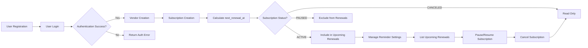

# User Scenarios and Functional Workflow for Subscription & Renewal Guardian

## 1. Introduction and Business Context

Subscription & Renewal Guardian is designed to empower users to track their personal subscriptions and upcoming renewal dates efficiently. This document defines comprehensive user scenarios and business workflows to guide backend developers during implementation. It emphasizes precise functional requirements, user roles, permissions, error handling, and performance expectations. The service aims to reduce subscription-related surprises through timely renewal tracking and reminder settings.

## 2. User Roles and Authentication

- **User Role:** Users can register, login, and manage only their own subscriptions, vendors, and reminder settings. Users cannot view or modify other users’ data.
- **Admin Role:** Admins have read-only access to list and view all users and their subscriptions but cannot modify any data.
- **Guest Role:** Unauthenticated users who may register and login.

### Authentication Requirements

WHEN a guest submits registration with email and password, THE system SHALL validate input and create a new user account.

WHEN a registered user submits login credentials, THE system SHALL authenticate the user and issue a JWT token containing user ID and role.

IF authentication fails, THEN THE system SHALL return an HTTP 401 Unauthorized error with descriptive message.

WHILE a JWT token is valid, THE system SHALL authorize access to endpoints according to user role.

## 3. Core Entities and Attributes

- **User:** Unique identifier with authentication credentials.
- **Vendor:** Unique name identifier representing service providers such as Netflix.
- **Subscription:** Attributes include id, user_id, vendor_id, plan_name, billing_cycle (enum: MONTHLY, YEARLY, WEEKLY, DAILY), amount (non-negative), currency (3-letter ISO code), started_at (UTC ISO8601), next_renewal_at (auto-calculated UTC ISO8601), status (ACTIVE, PAUSED, CANCELED), and optional notes.
- **ReminderSetting:** Linked to subscription; multiple settings allowed with unique days_before (enum: 7, 3, 1) per subscription. Channel enum: EMAIL or NONE.

## 4. User Scenario Flows

### 4.1 Signup and Login

WHEN a guest submits email and password to register, THE system SHALL create a user account with secure storage of credentials and return a success response.

WHEN a user submits login credentials, THE system SHALL validate credentials. IF correct, THE system SHALL issue a JWT token valid for a limited period; ELSE return HTTP 401 Unauthorized.

### 4.2 Vendor Creation

WHEN a user submits a vendor creation request with a unique vendor name, THE system SHALL verify uniqueness case-insensitively and persist the vendor; ELSE return HTTP 409 Conflict.

### 4.3 Subscription Creation and Lifecycle

WHEN a user creates a subscription with mandatory fields including vendor_id, plan_name, billing_cycle, amount, currency, started_at, and optional notes, THE system SHALL:
- Validate input data types and constraints.
- Enforce uniqueness of (user_id, vendor_id, plan_name).
- Auto-calculate next_renewal_at by advancing started_at by billing_cycle intervals until strictly greater than current UTC time and persist it.
- Set status to ACTIVE by default unless explicitly provided and valid.

WHEN a user updates a subscription, THE system SHALL:
- Permit modification only if status is ACTIVE or PAUSED.
- Recalculate and persist next_renewal_at if billing_cycle, started_at, or status changes.
- Reject modifications on CANCELED subscriptions with HTTP 403 Forbidden.

### 4.4 Managing Subscription Status

WHEN a user requests to pause a subscription with status ACTIVE, THE system SHALL update status to PAUSED.

WHEN a user wants to resume a subscription with status PAUSED, THE system SHALL update status to ACTIVE.

WHEN a user cancels a subscription (status ACTIVE or PAUSED), THE system SHALL update status to CANCELED. This transition is final; no further modifications allowed.

### 4.5 Reminder Settings

WHEN a user adds a reminder setting for a subscription, THE system SHALL:
- Enforce uniqueness of (subscription_id, days_before).
- Accept channel values EMAIL or NONE.

WHEN a user deletes a reminder setting, THE system SHALL remove the setting.

### 4.6 Listing Upcoming Renewals

WHEN a user requests upcoming renewals within 30 days, THE system SHALL:
- Return subscriptions with status ACTIVE.
- Exclude subscriptions with status PAUSED or CANCELED.
- Sort results ascending by next_renewal_at.
- Support pagination via limit and offset query parameters.

## 5. Business Rules and Constraints

- Vendor names MUST be unique, case insensitive.
- Subscription uniqueness enforced on (user_id, vendor_id, plan_name).
- Currency codes MUST conform to 3-letter ISO 4217.
- Amounts MUST be non-negative decimals.
- next_renewal_at MUST be recalculated on create/update when relevant fields change.
- Status transitions SHALL only allow ACTIVE <-> PAUSED and terminal CANCELED.
- Reminder settings MUST be unique per (subscription_id, days_before).

## 6. Pagination, Error Handling, and Validation

- All list endpoints SHALL support limit and offset parameters.
- DTOs SHALL be validated stringently; invalid inputs reject the request with HTTP 400 including detailed errors.
- Unauthorized actions SHALL result in HTTP 401 or 403 with clear messages.
- Duplicate entity creation SHALL result in HTTP 409 Conflict.

## 7. Mermaid Diagram

## 8. Summary

THE requirements defined herein specify clear, actionable, and comprehensive user scenarios and business processes for the Subscription & Renewal Guardian backend system. This document uses EARS format for all functional requirements to ensure unambiguous interpretation by backend developers.

The service provides secure JWT-based authentication, strict user roles, detailed subscription lifecycle management with renewal tracking, configurable reminder settings, and supports pagination and error handling consistently.

All implementation choices, API design, and data storage are delegated to the development team. This document strictly defines WHAT the system shall do, not HOW it shall be built.