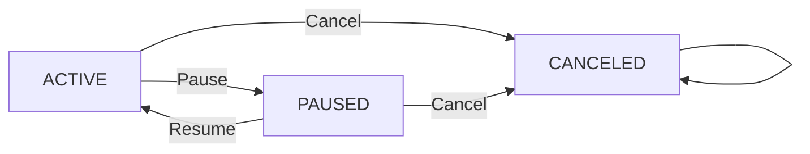

# Requirements Analysis Report for Subscription & Renewal Guardian Backend

## 1. Introduction

The Subscription & Renewal Guardian backend service is designed to help users track and manage their personal subscriptions and upcoming renewal dates efficiently. It addresses the prevalent issue of users losing track of multiple subscriptions leading to unintentional renewals and unexpected charges.

## 2. Business Model

### 2.1 Why This Service Exists

The proliferation of subscription-based services has increased financial complexity for users. Many struggle to keep track of various billing cycles and renewal periods, leading to unwanted charges or lapses in service. This system offers a simple, centralized platform to manage and monitor these subscriptions.

### 2.2 Revenue Strategy

Though payments and external processing are out of this scope, the system may later monetize through advanced features or partnerships.

### 2.3 Core Value Proposition

- Centralized subscription tracking
- Automated renewal calculations
- User-configurable reminder settings
- Secure, role-based access

## 3. User Roles and Authentication

### 3.1 Roles

- **User**: Authenticated individual managing personal subscriptions and related data only.
- **Admin**: Read-only access to all users' subscriptions and data.
- **Guest**: Unauthenticated visitors allowed to register and login.

### 3.2 Authentication Flow

- Users register with email and password.
- JWT tokens issued upon login, containing userId and role.
- No refresh token support.

### 3.3 Permission Rules

- Users can create, read, update, and delete own subscriptions and reminders.
- Admins can only view all user data but cannot modify.
- Guests have access to registration and login only.

## 4. Core Domain Entities

### 4.1 User

Represents an authenticated individual with credentials and profile data.

### 4.2 Vendor

Stores subscription providers with unique names.

### 4.3 Subscription

Tracks individual user subscriptions:
- Unique by (user_id, vendor_id, plan_name)
- Fields: billing_cycle, amount, currency, status, started_at, next_renewal_at, notes
- Status enums: ACTIVE, PAUSED, CANCELED
- Auto-calculation of next_renewal_at upon create/update based on billing_cycle and started_at

### 4.4 Reminder Setting

Allows multiple reminders per subscription:
- Unique (subscription_id, days_before)
- Channels: EMAIL or NONE

## 5. Functional Requirements

5.1 Authentication

- WHEN a user registers, THE system SHALL create an account.
- WHEN a user logs in, THE system SHALL authenticate them and issue a JWT.

5.2 Vendor Management

- Users SHALL create vendors with unique names.
- Duplicate names SHALL be rejected.

5.3 Subscription Management

- Unique (user_id, vendor_id, plan_name) enforced.
- next_renewal_at auto-calculated and persisted.
- Allowed status transitions ACTIVE <-> PAUSED.
- CANCELED is terminal; no further modifications allowed.

5.4 Reminder Management

- Multiple reminders allowed per subscription.
- Uniqueness on (subscription_id, days_before) enforced.

5.5 Renewal Listings

- Upcoming renewals listed for ACTIVE subscriptions only within 30 days.
- Listings sorted by next_renewal_at ascending.

5.6 Pagination

- Support for limit and offset pagination parameters.

## 6. Business Rules

- Billing cycles enums: DAILY, WEEKLY, MONTHLY, YEARLY.
- Amounts >= 0, currency codes ISO 4217.
- vendor.name unique.
- No modification of CANCELED subscriptions except read.
- next_renewal_at calculated by incrementing started_at by billing_cycle until > current UTC time

## 7. Error Handling

- Consistent error responses with HTTP codes.
- Detailed validation errors on bad input.
- Authorization failures return HTTP 403.
- Duplicate conflicts return HTTP 409.

## 8. Performance Requirements

- API responses within 2 seconds.
- Efficient paging and filtering mechanisms.

## 9. Mermaid Diagrams

## 10. Summary

This document defines precise business requirements to ensure developers have an unambiguous, testable foundation for building the Subscription & Renewal Guardian backend service. It specifies user roles, domain entities, workflows, business rules, error handling, and performance criteria.

> This document provides business requirements only. All technical implementation decisions (architecture, APIs, database design) belong to developers. It describes what the system must do, not how to build it.
