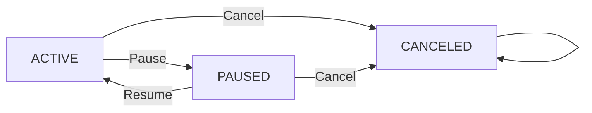

# Requirements Analysis for Subscription & Renewal Guardian Backend

## 1. Introduction and Business Justification

Subscription & Renewal Guardian is a backend system designed to assist users in tracking their personal subscription services and upcoming renewals, addressing the frequent pain point of losing track of multiple active subscriptions and renewal dates. This service enables users to monitor subscription statuses, renewal dates, and configure reminders ahead of time to avoid unexpected charges.

### Business Model

- **Why this service exists:** Many users struggle with managing multiple subscriptions from various vendors, resulting in unwanted renewals and financial inefficiencies. This system centralizes subscription data and automates the tracking of renewal dates to empower users.

- **How it operates:** Users manage subscriptions linked to vendors with details like billing cycle and amount. The system calculates upcoming renewal dates and allows users to pause, resume, or cancel subscriptions.

- **Revenue and growth potential:** Initially offered as a free tool, the platform may evolve to include premium features such as enhanced reminders or reporting.

## 2. User Roles and Authentication

- **User:** Standard users who can manage only their own subscriptions, vendors, and reminder settings.
- **Admin:** Read-only users with permission to list and view all users’ subscriptions and data but no modification rights.

- **Authentication:** Uses minimal JWT-based authentication with signup and login via email and password. No refresh tokens.

- **Permissions:** Users can perform CRUD operations only on their own data. Admins have read-only access to all data.

## 3. Core Domain Entities and Relationships

- **User:** Represents an individual user with credentials and identifiers.
- **Vendor:** Subscription providers uniquely identified by their name.
- **Subscription:** Tracks user subscriptions including plan name, billing cycle (MONTHLY, YEARLY, WEEKLY, DAILY), amount, currency (ISO 4217 3-letter code), start date, next renewal date, status (ACTIVE, PAUSED, CANCELED), and notes.
- **Reminder Setting:** Multiple reminders per subscription allowed, with days_before (7, 3, 1), channel (EMAIL or NONE), unique per subscription on days_before.

## 4. Functional Requirements

- WHEN a user registers, THE system SHALL validate the email and create a user account.
- WHEN a user logs in with valid credentials, THE system SHALL issue a JWT token.
- WHEN a user creates a vendor, THE system SHALL enforce vendor name uniqueness.
- WHEN a subscription is created or updated, THE system SHALL calculate and persist next_renewal_at by advancing started_at by billing cycle intervals until strictly greater than current UTC time.
- WHILE subscription status is CANCELED, THE system SHALL forbid any modifications except read.
- Users SHALL be able to pause or resume subscriptions between ACTIVE and PAUSED.
- THE system SHALL provide paginated listings using limit and offset.
- THE system SHALL list upcoming renewals for active subscriptions within 30 days sorted by next_renewal_at ascending.
- THE system SHALL enforce uniqueness on reminder settings per (subscription_id, days_before).

## 5. Business Rules and Constraints

- Currency codes SHALL be valid ISO 4217 3-letter codes.
- Amounts SHALL be zero or positive.
- Vendor names MUST be unique.
- Subscription uniqueness enforced on (user_id, vendor_id, plan_name).
- Subscription status transitions allowed only ACTIVE ↔ PAUSED; CANCELED is terminal.
- next_renewal_at calculated on create/update by incrementing billing cycle.
- Reminder settings uniqueness on subscription and days_before.

## 6. Error Handling and User Experience

- THE system SHALL provide consistent error messages for authentication failures.
- Unauthorized actions SHALL return HTTP 403 errors.
- Validation errors SHALL detail field errors.
- Attempting forbidden status changes SHALL report clear error messages.

## 7. Performance and Scalability

- THE system SHALL respond within 2 seconds for standard queries.
- Pagination SHALL be default with limit and offset.

## Mermaid Diagram: Subscription Status Transitions

---

The document provides business requirements only. Developers have full autonomy on architecture, APIs, and database design. It describes WHAT to build, not HOW.