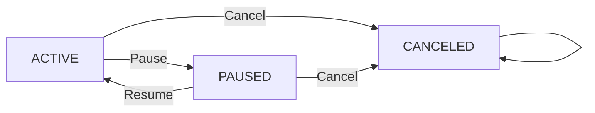

# Requirements Analysis Report for Subscription & Renewal Guardian Backend

## 1. Introduction and Business Context

The Subscription & Renewal Guardian backend service provides a centralized platform for users to monitor their personal subscriptions and proactively manage upcoming renewal dates. It addresses a common pain point where individuals lose track of recurring payments, resulting in unexpected charges or service interruptions.

### 1.1 Project Overview

This backend service supports managing user subscriptions associated with a variety of vendors. Users can create, update, pause, resume, or cancel subscriptions, configure reminders for upcoming renewals, and view upcoming renewal lists. Admin users have read-only access to monitor all users' subscription data.

### 1.2 Business Justification

Many users juggle multiple subscription services with different billing cycles and costs. Without effective tracking, renewals can be missed or unwanted charges might occur. Subscription & Renewal Guardian fills this market gap by offering a simple and private way to track and manage personal subscriptions.

## 2. Business Model

### 2.1 Why This Service Exists

The modern subscription economy presents users with many overlapping plans and vendors, making manual tracking complicated and error-prone. The service provides automated renewal tracking and flexible reminder configurations to empower users and avoid unpleasant surprises.

### 2.2 Revenue and Growth Strategies

While initial scope excludes payment processing or monetization, potential revenue models include offering premium features, analytics, or vendor partnerships. Growth will focus on organic user acquisition, retention via reminders, and eventual premium upselling.

### 2.3 Success Metrics

- Number of active users managing subscriptions
- Accuracy and timeliness of renewal reminders
- User retention and engagement with subscription management features

## 3. User Roles and Authentication

### 3.1 Role Definitions

- **User**: Authenticated users managing only their own subscriptions, vendors, and reminders.
- **Admin**: Read-only role viewing all users' subscription data.
- **Guest**: Unauthenticated visitors allowed to register and log in.

### 3.2 Authentication Flow

- Users register with email and password.
- Login endpoint returns JWT tokens with user id and role.
- No refresh tokens included; tokens expire on a short timescale.

### 3.3 Role Permissions

- Users can create/read/update/delete only their own subscriptions and reminders.
- Admins have read-only access to all user data.

## 4. Core Domain Entities

### 4.1 User

Represents system users with unique IDs and credentials.

### 4.2 Vendor

Service providers such as Netflix or Spotify with globally unique names.

### 4.3 Subscription

Contains the following attributes:
- `id`
- `user_id` referencing owner
- `vendor_id`
- `plan_name`
- `billing_cycle` enum (MONTHLY, YEARLY, WEEKLY, DAILY)
- `amount` (number >= 0)
- `currency` (3-letter ISO code string)
- `started_at` (ISO8601 UTC datetime)
- `next_renewal_at` (ISO8601 UTC datetime) auto-calculated and persisted
- `status` enum (ACTIVE, PAUSED, CANCELED)
- `notes` optional

Subscriptions are unique on the tuple `(user_id, vendor_id, plan_name)`.

### 4.4 ReminderSetting

- `subscription_id`
- `days_before` enum (7, 3, 1)
- `channel` enum (EMAIL, NONE)

Multiple reminders per subscription allowed; unique constraint on `(subscription_id, days_before)` applies.

## 5. Functional Requirements

### 5.1 Subscription Management

- WHEN a user creates a subscription, THE system SHALL validate inputs, enforce uniqueness on `(user_id, vendor_id, plan_name)`, and calculate `next_renewal_at` by advancing from `started_at` using `billing_cycle` increments until strictly greater than current UTC time.
- WHEN subscription's `billing_cycle`, `started_at`, or `status` changes, THE system SHALL recalculate and persist `next_renewal_at`.
- WHILE subscription status is CANCELED, THE system SHALL disallow any modifications except reading.
- THE system SHALL allow status transitions ACTIVE <-> PAUSED; cancellation is terminal.

### 5.2 Vendor Management

- Users SHALL be able to create vendors with unique names.
- Vendor creation SHALL be rejected if the name duplicates.

### 5.3 Reminder Settings Management

- Users SHALL be able to add multiple reminders per subscription.
- THERE SHALL be a unique constraint on `(subscription_id, days_before)`.
- Reminder channels SHALL be EMAIL or NONE.

### 5.4 Renewal Tracking and Notifications

- THE system SHALL provide listings of upcoming renewals within a default window of 30 days.
- Listings SHALL exclude subscriptions with PAUSED or CANCELED statuses.
- Listings SHALL be sorted ascending by `next_renewal_at`.

### 5.5 Authentication and Authorization

- BEHAVIOR SHALL follow JWT-based minimal authentication with signup and login flows.
- JWT tokens SHALL include user id and role.
- Authorization SHALL restrict data access according to user roles.

### 5.6 Pagination and DTO Validation

- THE system SHALL support limit/offset pagination for list endpoints.
- Input validation SHALL be enforced on all DTOs with consistent error models.

## 6. Business Rules and Constraints

- Vendor names MUST be unique.
- Subscription uniqueness on `(user_id, vendor_id, plan_name)` enforced.
- Currency MUST be valid ISO 4217 codes.
- Amount MUST be zero or positive.
- `next_renewal_at` shall be calculated per billing cycle rules.
- Status may transition ACTIVE <-> PAUSED only; CANCELED is terminal.
- Reminder settings must be unique on `(subscription_id, days_before)`.
- Users can only access and modify their own data; admins have read-only access to all.

## 7. Error Handling and User Feedback

- Authentication failures SHALL return HTTP 401 with clear error messages.
- Authorization failures SHALL return HTTP 403.
- Validation errors SHALL be reported with detailed field-specific messages.
- Attempts to modify CANCELED subscriptions SHALL be rejected with HTTP 409 or suitable error.

## 8. Non-functional and Performance Requirements

- The system SHALL respond within 2 seconds for typical API calls.
- Pagination SHALL be implemented and supported on all relevant endpoints.
- Dates SHALL be stored as UTC ISO8601; Asia/Seoul timezone context applies for frontend display.
- Consistent, descriptive error models shall be provided.

## 9. Mermaid Diagrams

## 10. Summary and Developer Autonomy Statement

This report strictly defines business requirements for the Subscription & Renewal Guardian backend service. It provides developers clear, testable, and unambiguous specifications regarding user roles, authentication flows, subscriptions lifecycle, reminders, renewal tracking, and error handling.

All technical implementation decisions, such as database design, API specifics, or infrastructure, are delegated to the development team. This document describes WHAT the system must do, not HOW to build it.
