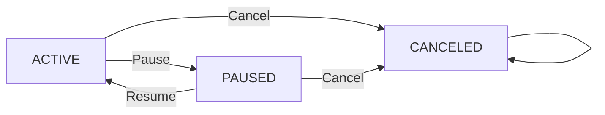

# Requirements Analysis Document for Subscription & Renewal Guardian Backend

## 1. Introduction

### 1.1 Project Overview
Subscription & Renewal Guardian is a backend service designed to allow individual users to track their personal subscriptions and upcoming renewal dates effectively. The system supports managing subscriptions to various vendors such as Netflix and Spotify, calculates upcoming renewal dates automatically, and enables users to configure reminders.

### 1.2 Business Justification

#### Why This Service Exists
Many consumers face difficulty managing multiple subscription services with different billing cycles, amounts, and renewal dates, resulting in unexpected charges or unwanted renewals. Subscription & Renewal Guardian fills this gap by providing a centralized platform to track subscriptions, renewal dates, and send reminders.

#### Revenue and Growth Strategy
The initial service offering is free, focusing on user acquisition by providing value through reliable subscription management and renewal reminders. Future monetization options include premium features such as advanced notifications and vendor insights.

#### Success Metrics
Key performance indicators include monthly active users, retention rates, accurate renewal notifications, and user satisfaction with subscription management.

## 2. Business Model

### 2.1 Why This Service Exists
Subscription & Renewal Guardian addresses the challenge of managing multiple subscription services to prevent unexpected charges and assist in budgeting.

### 2.2 Revenue Strategy
The service’s potential revenue avenues include premium subscriptions, targeted advertisements, and partnerships with subscription providers.

### 2.3 Growth Plan
Growth will focus on organic marketing strategies, user referral programs, and continuous improvement of the subscription management experience.

### 2.4 Success Metrics
Tracking user engagement, subscription retention, and the frequency and accuracy of renewal reminders will measure business success.

## 3. User Roles and Authentication

### 3.1 Defined User Roles
- **User**: Individuals managing their own subscriptions and reminders.
- **Admin**: User with read-only access to all users’ subscriptions.

### 3.2 Permissions
- Users can create, read, update, and delete only their own subscriptions, vendors, and reminders.
- Admins have read-only access to all users’ data.

### 3.3 Authentication Flows
- Users register with email and password.
- Users login to obtain JWT tokens for authentication.
- No refresh tokens are implemented.

### 3.4 Role-based Access Control
- User roles encoded within JWT tokens.
- Access to resources restricted based on role and ownership.

## 4. Domain Entities

### 4.1 Core Entities
- **User**: Represents system users with authentication data.
- **Vendor**: Uniquely identified by name, representing a subscription provider.
- **Subscription**: Contains details such as plan name, billing cycle, amount, currency, started date, next renewal date, status, and optional notes.
- **ReminderSetting**: Configures reminder timings and channels per subscription.

### 4.2 Unique Constraints
- Vendor names must be unique.
- Subscriptions must be unique by user, vendor, and plan name.
- Reminder settings must be unique per subscription by days_before.

## 5. Functional Requirements

### 5.1 Authentication Requirements
- WHEN a user submits signup data, THE system SHALL validate the information and create a user account.
- WHEN a user submits login credentials, THE system SHALL authenticate and issue a JWT token.
- WHILE a user holds a valid JWT, THE system SHALL permit access to authorized resources.

### 5.2 Vendor Management
- Users SHALL be able to create vendors with unique names.
- Duplicate vendor names SHALL be rejected.

### 5.3 Subscription Management
- Users SHALL be able to create, update, pause, resume, and cancel subscriptions with validations.
- THE system SHALL auto-calculate and persist next_renewal_at upon subscription creation or update.
- THE system SHALL prevent modifications on CANCELED subscriptions.

### 5.4 Reminder Settings
- Users SHALL be able to add multiple reminder settings per subscription.
- THE system SHALL enforce uniqueness on reminder days_before per subscription.

### 5.5 Renewal Tracking
- THE system SHALL provide a listing of upcoming renewals within 30 days.
- Renewals SHALL exclude subscriptions with PAUSED or CANCELED status.
- THE list SHALL be sorted ascending by next_renewal_at.

### 5.6 Pagination and Validation
- List endpoints SHALL support limit/offset pagination.
- Input data SHALL be validated strictly with descriptive errors.

## 6. Business Rules

### 6.1 Subscription Status Transitions
- ACTIVE ↔ PAUSED transitions are allowed.
- CANCELED status is terminal; no status reactivation allowed.

### 6.2 Currency and Amount Constraints
- Amounts SHALL be non-negative.
- Currency codes SHALL be 3-letter ISO 4217 strings.

### 6.3 Renewal Date Calculation
- Upon create or update of subscription fields, THE system SHALL calculate next_renewal_at by advancing billing cycles until strictly greater than current UTC time.

## 7. Error Handling

### 7.1 Authentication Errors
- IF authentication fails, THEN THE system SHALL return HTTP 401 with an appropriate error message.

### 7.2 Authorization Failures
- IF a user tries to access or modify data they don’t own, THEN THE system SHALL return HTTP 403 Forbidden.

### 7.3 Validation Errors
- IF input data violates constraints, THEN THE system SHALL respond with HTTP 400 and detailed error information.

### 7.4 Business Rule Violations
- IF a subscription is CANCELED and a modification is attempted, THEN THE system SHALL reject with appropriate error.

## 8. Performance Requirements

- The system SHALL respond to authentication and CRUD operations within 2 seconds under normal usage.
- Pagination SHALL be implemented efficiently with limit and offset.

## 9. Diagrams

### 9.1 Subscription Status State Transitions

## 10. Summary

THE document represents complete business requirements for the Subscription & Renewal Guardian backend system. It describes user roles, authentication, domain entities, business logic, functional processes, and performance expectations in clear, measurable terms.

> This document provides business requirements only. All technical implementation decisions belong to developers. Developers have full autonomy over architecture, APIs, and database design. It describes WHAT the system shall do, not HOW to build it.
