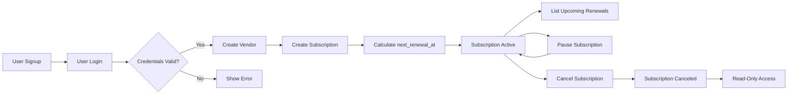

# Subscription & Renewal Guardian - Critical User Scenarios and Testing Requirements

## 1. Introduction

The Subscription & Renewal Guardian backend service focuses on allowing users to track personal subscriptions and upcoming renewals efficiently. This document outlines the critical user journeys required for the system's robust functionality and provides business requirements that underpin end-to-end testing strategies.

## 2. Business Model

Users rely on this system to manage subscriptions from vendors, ensuring timely renewal tracking and control over subscription status. The platform supports both standard user roles and read-only administrative views for oversight.

## 3. User Roles and Authentication

Users authenticate via a minimal JWT mechanism with email and password. Roles include regular users managing their own data and admins with read-only access across all user data.

## 4. Core Entities

Key entities are users, vendors, subscriptions, and reminder settings with strict constraints on subscription uniqueness and status management.

## 5. Functional Requirements and User Flows

### 5.1 User Signup and Login
- WHEN a guest registers with a valid email and password, THE system SHALL create a user account.
- WHEN a registered user logs in with valid credentials, THE system SHALL issue a JWT token.
- IF login fails, THEN THE system SHALL respond with an authentication error within 2 seconds.

### 5.2 Vendor Creation
- WHEN a user creates a vendor with a unique name, THE system SHALL persist the vendor.
- IF a duplicate vendor name is attempted, THEN THE system SHALL reject with a conflict error.

### 5.3 Subscription Creation
- WHEN a user creates a subscription, THE system SHALL validate all input data.
- THE system SHALL enforce uniqueness on (user_id, vendor_id, plan_name).
- THE system SHALL calculate next_renewal_at based on started_at and billing_cycle and persist it.

### 5.4 Subscription Status Changes
- Users SHALL be able to pause and resume subscriptions toggling between ACTIVE and PAUSED.
- CANCELED subscriptions SHALL be read-only; no modifications allowed after cancellation.

### 5.5 Listing Upcoming Renewals
- WHEN a user requests upcoming renewals within 30 days, THE system SHALL list all ACTIVE subscriptions with a next_renewal_at date within the range.
- PAUSED and CANCELED subscriptions SHALL be excluded.

## 6. Testing Strategy

- Implement E2E tests for signup/login, vendor creation, subscription lifecycle (create, pause/resume, cancel), and renewal listings.
- Tests SHALL verify validations, status transitions, uniqueness constraints, and correct calculation of next_renewal_at.
- Error scenarios MUST be tested, including duplicate vendors, invalid subscription modifications, and authentication failures.

## 7. Non-Functional Requirements

- All requests SHALL complete within 2 seconds under normal load.
- Pagination SHALL be supported on listings.
- Inputs SHALL be validated strictly with descriptive error messages.

## 8. Diagrams

---

This document provides business requirements only. All technical implementation decisions belong to developers. Developers have full autonomy over architecture, APIs, and database design. This document describes WHAT the system should do, not HOW to build it.
